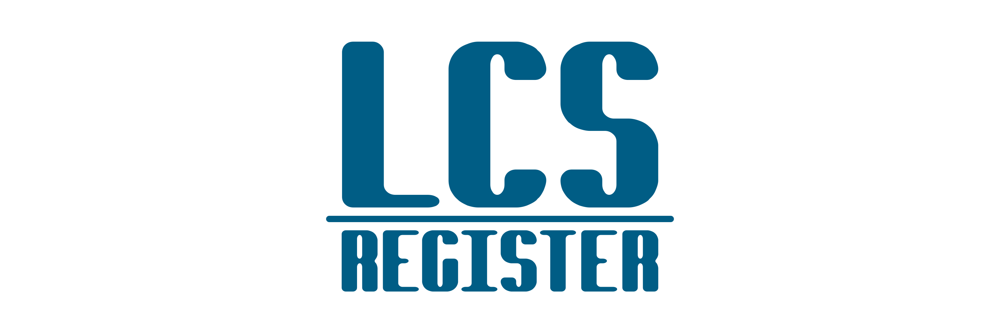

   

-----------------

# LCS Register

The LCS Register is a customer registration.

Project made for university, Data Structure class.

Building using C programming language.

Author: [Wesley Mendes](https://github.com/WesGtoX)

## What is C language? ##

C is a powerful general-purpose programming language. It is fast, portable and available in all platforms. If you are new to programming, C is a good choice to start your programming journey.

### License ###

[MIT](LICENSE)